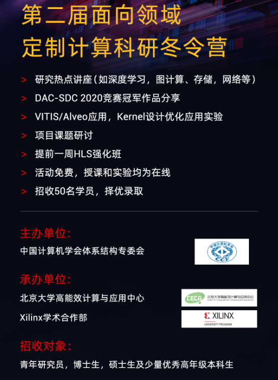

# 2021 面向领域的定制计算冬令营

## Introduction:
2021年1月25日至2月5日，为期两周的冬令营由CCF体系结构专委会主办，北京大学高能效计算与应用中心与Xilinx学术合作联合承办。  
北京大学，清华大学，计算所，浙江大学，北京工业大学，Xilinx等来自学术界工业界多位研究院与近200位老师和同学分享研讨了定制计算的前沿方向。  
第一周为HLS强化班，对Vivado HLS的基本原理，性能优化细节和相关编程技巧都进行了充足的实践    
第二周以面向以下领域介绍了的计算加速从算法到硬件，同时也帮助学员们熟悉了Vitis工具的使用  
-深度学习加速器  
-数据库  
-图计算  
-存储与网络  
-虚拟化技术  
本次冬令营同时也介绍了Xilinx Adaptive Compute Clusters（XACC)，以下为XACC项目的链接：
*  [Xilinx Adaptive Compute Clusters](https://xilinx.github.io/xacc/)

## Schedule

日期 | 主题
-|-
1月25日 | Vivado HLS原理，HLS Lab 1-2
1月26日 | Vivado HLS性能优化，HLS Lab 3-4
1月27日 | Vivado HLS编程技巧讨论，PYNQ框架
1月28日 | 实验：深度学习加速器HLS设计，实验：PP4FPGAs
1月29日 | AI加速器设计研讨，深度学习加速器课程研讨
2月1日 | 面向机器学习的可重构计算，VITIS 技术剖析，Lab：VITIS Intro Part1 Part2
2月2日 | 定制AI加速器设计，DAC2020-SDC冠军队伍作品分享，HBM性能优化，Lab：VITIS Improving Performance
2月3日 | Parallel graph processing on heterogenous architectures，VITIS Lib如HPC，CV，Database
2月4日 | SmartSSD-数据与计算存储，Towards Distributed Adaptive Computing，FPGA on cloud and datacenters
2月5日 | FPGA虚拟化，FPGA云编译平台YEDA，资源分享

## Course Materials:
* [HLS Hands-on Labs](https://github.com/xupgit/High-Level-Synthesis-Flow-on-Zynq-using-Vivado-HLS)
* [Vitis Hands-on Labs](https://xilinx.github.io/xup_compute_acceleration/)

## Other Materials:
关于更多信息也可以访问公众号获得  

## Featured Projects

No. | Team Member | Project Name | Status
-|-|-|-
1| 孔祥聪 黄莹| [Algorithm-hardware co-design for pulsar coherent de-dispersion algorithm on FPGA.](https://github.com/kongxiangcong/Pulsar-FPGA)| 完成
2| 张锦玉 | [基于FPGA的模型预测控制算法加速](https://github.com/zhang-jinyu/IIoT-SPYN/tree/2021_CN_WinterCamp)| 完成
3| 卢浩迪 | [FPGA-based data migration of network access](https://github.com/Lhoddy/fpga_demo) | 完成
4| 任骥恺 | [HLS Implementation of LZ77 Data Compression Algorithm](https://github.com/bjrjk/HLS-LZ77) | 完成
5| 王璇铮 吴震宇  | [Stencil computation on FPGA](https://github.com/KevinLikesDringCoffe/Stencil-computation-on-FPGA) | 完成
6| 杨雨昕 宋涛 | [A Study of Inverse Kinematics Algorithm and Its System Architecture Implementation](https://github.com/CICS-ICT/ik-acceleration) | 完成
7| 杜泽林 | [Accelerate the tiny-yolov2](https://github.com/duzelin/Convor.git) | 完成

## Other Projects

No. | Team Member | Project Name | Status
-|-|-|-
1| 郭慧 罗云臻| [利用Vitis AI部署CNN模型](https://github.com/CSU-GH/XilinxWinterCampProject)| 完成
2| 陈超 | [使用HLS功能实现熵计算的数字电路计算IP](https://github.com/AllenChenChao/20210208HLS_for_entropy)| 完成
3| 戴卓辰 | [人脸检测](https://github.com/XS30/Face-detection-in-PYNQ) | 完成
4| 陈桂荣 | [多通道卷积，通过脉动阵列实现性能优化](https://github.com/minicarbon/winter_camp_project) | 完成
5| 陈相任 | [Partial hardware implementation of Groth16 algorithm](https://github.com/chenxiangren1/Groth16) | 完成
6| 刘珂，曹美|[基于PYNQ的Resize算法加速设计](https://github.com/onWayforever/Xilinx_winterCamp/blob/master/readMe.md)| 完成
7| 姚博文 |[基于ZYNQ和AlexNet网络实现手写数字识别](https://github.com/yobuwen/hello-one) | 完成
8| 王光华 | [A project accelerate the CNN and deformable CNN in FPGA board](https://github.com/meicale/Acc_DeCNN_on_FPGA) | 完成
9| 周洪涛 |[二值图标记算法](https://github.com/ZhouHunt/Two-Scan-Labeling-implemented-on-FPGA) | 完成
10| Introspecting| [DepthwiseCONV-HLS](https://github.com/Introspecting/DepthwiseCONV-HLS) | 完成
11| 周炎亮 | [Using FPGAs to accelerate BFS algorithm](https://github.com/triode-zyl/BFS-on-FPGA) | 完成
12| 赵海旭| [利用FPGA提升SHA256加密算法速度](https://github.com/zhaohaixu/SHA256-FPGA-HLS) | 完成
13| 于大江 | [FAST-algorithm-for-corner-detection](https://github.com/djgq2020/FAST-algorithm-for-corner-detection/blob/main/README.md) | 完成
14| 李坚松 | [VTA: Deep Learning Accelerator Stack](https://gitee.com/json-lee/fpga-getting-started ) | 完成
15| 韩萌 | [tinyFPS:HLS-based Farthest point sampling Accelerator](https://github.com/hanm2019/tinyFPS) | 完成
16| 周聪 | [SRC-Vitis](https://github.com/sazczmh/SRC-Vitis) | 完成
17| 任兴 | [Signal tracking based on LMS](https://github.com/rx978871284/Signal-tracking-based-on-LMS.git) | 完成
18| 姜有亮 | [基于Ultra96-V2平台加速一种卷积神经网络](https://github.com/cocoyomi/Accelerate-ConvNet-on-Ultra96V2) | 完成
19| 陆韦辛| [latex文本识别]( https://github.com/aceansgar/latex_recognition/blob/main/readme.md) | 待更新
20| 丁圣杰| [智能硬件加速器的搭建](https://github.com/AI-Unicorn-D/Design-of-accelerator-based-on-zcu104/blob/main/README.md)| 待更新
21| 边浩东 | [设计高性能并行接口SpMV](https://github.com/nulidangxueshen/2021_Xilinx_FPGA_SpMV/blob/main/README.md) | 待更新
22| 郭进阳 | [BFS Evaluation index](https://github.com/Jinyang-Guo/HBM-BFS) | 待更新
23| 谢坤鹏 | [基于Alveo平台的眼底网络实现 尝试使用FINN框架部署lenet5网络模型](https://github.com/xiekunpeng/Xilinx_Wintercamp) | 待更新
24| 于泽霖 | [A simple MIPS-like CPU demo in C++ for Xilinx Vivado HLS](https://github.com/junglehust/Vivado_HLS-Demo/blob/main/README.md) | 待更新
25| 徐诚 | [从HLS层面将HBM与图算法相结合,实现pagerank或bfs算法](https://github.com/jerryxucheng/vitis) | 待更新
